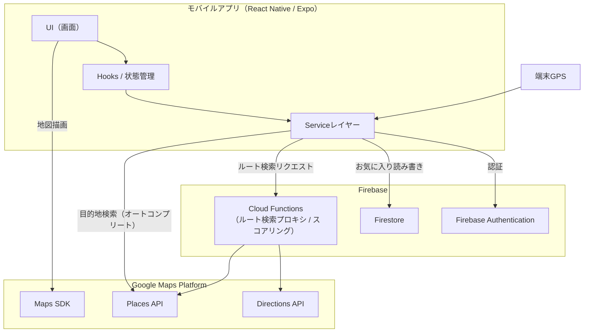
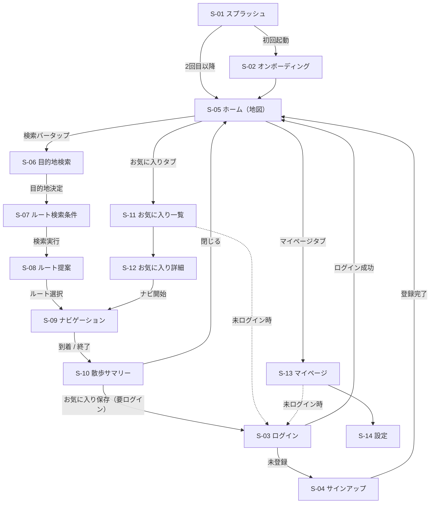
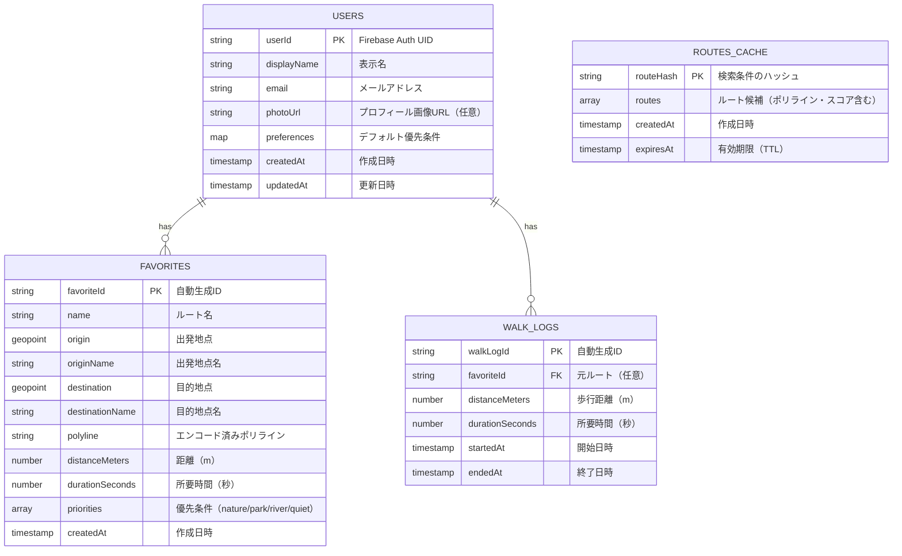

# 散歩ナビ（仮称）仕様書

- **バージョン**: 1.1.0
- **最終更新日**: 2026-07-02
- **ステータス**: ドラフト
- **開発体制**: 個人開発（リリース期限なし）。将来的なチーム開発への移行を想定した運用ルールを併記する

---

## 目次

1. [アプリ概要](#1-アプリ概要)
2. [開発目的](#2-開発目的)
3. [ターゲットユーザー](#3-ターゲットユーザー)
4. [機能要件](#4-機能要件)
5. [非機能要件](#5-非機能要件)
6. [システム構成](#6-システム構成)
7. [技術スタック](#7-技術スタック)
8. [画面一覧](#8-画面一覧)
9. [画面遷移図](#9-画面遷移図)
10. [データベース設計（Firestore）](#10-データベース設計firestore)
11. [API設計](#11-api設計)
12. [ディレクトリ構成](#12-ディレクトリ構成)
13. [開発ルール](#13-開発ルール)
14. [Git運用ルール](#14-git運用ルール)
15. [命名規則](#15-命名規則)
16. [エラーハンドリング](#16-エラーハンドリング)
17. [セキュリティ](#17-セキュリティ)
18. [MVP](#18-mvp)
19. [今後の拡張](#19-今後の拡張)
20. [開発タスク一覧](#20-開発タスク一覧)

---

## 1. アプリ概要

### 1.1 コンセプト

最短距離ではなく、**「歩くこと自体を楽しめるルート」** を案内する散歩専用ナビゲーションアプリ。

通常の地図アプリは最短時間・最短距離を重視するが、本アプリでは以下の要素を優先したルートを提案する。

| 優先要素 | 説明 |
| --- | --- |
| 景色が良い | 眺望スポット・街並みの良いエリアを経由する |
| 自然が多い | 緑地・並木道などを優先する |
| 公園を通る | ルート上に公園を組み込む |
| 川沿いを歩ける | 河川敷・遊歩道を優先する |
| 人混みが少ない | 混雑エリアを避ける |
| 車通りが少ない | 交通量の多い幹線道路を避ける |

### 1.2 提供プラットフォーム

- iOS（App Store）
- Android（Google Play）

---

## 2. 開発目的

1. **散歩体験の質の向上**
   既存の地図アプリでは実現できない「移動の過程を楽しむ」体験を提供する。
2. **健康促進**
   歩くことが楽しくなるルート提案により、日常的なウォーキング習慣の形成を支援する。
3. **地域の魅力の再発見**
   普段通らない道・公園・川沿いなど、地域の隠れた魅力に出会う機会を創出する。
4. **観光客への新しい街歩き体験の提供**
   目的地への移動自体を観光コンテンツ化する。

---

## 3. ターゲットユーザー

| ユーザー層 | 利用シーン | 主なニーズ |
| --- | --- | --- |
| 散歩好き | 日常の散歩 | 新しい道・飽きないルート |
| ウォーキング利用者 | 運動習慣 | 距離・時間を指定した快適なルート |
| 観光客 | 旅行先での街歩き | 景観の良い移動ルート |
| 写真撮影が好きな人 | 撮影スポット巡り | フォトジェニックな場所を通るルート |
| 健康目的で歩く人 | 通勤前後・休日 | 安全で歩きやすいルート |

---

## 4. 機能要件

### 4.1 MVP機能

| ID | 機能名 | 概要 | 優先度 |
| --- | --- | --- | --- |
| F-01 | 現在地取得 | GPSでユーザーの現在地を取得・追従する | 高 |
| F-02 | 地図表示 | Google Mapsによる地図の表示・操作（ズーム/回転/移動） | 高 |
| F-03 | 目的地検索 | キーワード・住所から目的地を検索する（Places API） | 高 |
| F-04 | 散歩ルート検索 | 現在地〜目的地間の「散歩に適したルート」を検索する | 高 |
| F-05 | 散歩ルート表示 | 候補ルートを地図上にポリライン表示し、距離・所要時間を表示する | 高 |
| F-06 | ナビゲーション | 選択したルートに沿ってターンバイターン案内を行う | 高 |
| F-07 | お気に入り保存 | ルートをお気に入りとして保存・一覧・削除できる | 高 |
| F-08 | ユーザー認証 | メール/パスワード・Google認証によるサインアップ/ログイン | 高 |

### 4.2 機能詳細

#### F-01 現在地取得

- アプリ起動時に位置情報の利用許可をリクエストする
- 許可が得られない場合は、地図の初期表示位置をデフォルト地点（東京駅）とし、再許可への導線を表示する
- ナビゲーション中はフォアグラウンドで位置情報を継続取得する（更新間隔: 約1秒 / 距離フィルタ: 5m）

#### F-04 散歩ルート検索

- Directions API（mode=walking, alternatives=true）で複数の徒歩ルート候補を取得する
- 各ルートに対して「散歩適性」の観点でスコアリングし、上位ルートを提案する
  - Places API を用いてルート周辺の公園・緑地・水辺のPOI密度を評価する
  - 幹線道路の経由割合を低く評価する
- ユーザーは検索オプションとして以下を指定できる
  - 優先条件（自然 / 公園 / 川沿い / 静かさ）
  - 希望所要時間または距離（例: 30分 / 3km）— 目的地なしの周回ルートにも対応（MVPでは片道のみ）

#### F-06 ナビゲーション

- 選択ルートに沿った音声なしの画面案内（MVPでは音声案内は対象外）
- 次の曲がり角までの距離・方向を表示する
- ルート逸脱時は自動リルート（逸脱判定: ルートから30m以上乖離）
- 案内終了時に歩行距離・所要時間のサマリーを表示する

#### F-07 お気に入り保存

- ルート名（任意）を付けて保存できる
- 保存内容: 出発地・目的地・経路ポリライン・距離・所要時間・優先条件
- お気に入り一覧から再度ナビゲーションを開始できる
- 保存はログインユーザーのみ利用可能

---

## 5. 非機能要件

| 分類 | 要件 |
| --- | --- |
| パフォーマンス | ルート検索結果の表示は5秒以内。地図操作は60fpsを目標とする |
| 可用性 | Firebase / Google Maps Platform のSLAに準拠。オフライン時はエラーメッセージと再試行導線を表示 |
| バッテリー | ナビゲーション中以外は位置情報の高頻度取得を行わない |
| セキュリティ | 通信は全てHTTPS。認証はFirebase Authenticationを使用（詳細は[17章](#17-セキュリティ)） |
| プライバシー | 位置情報はナビゲーション目的のみに使用し、履歴をサーバーへ常時送信しない |
| 対応OS | iOS 15以上 / Android 10（API 29）以上 |
| 多言語 | MVPは日本語のみ。将来的に英語対応 |
| アクセシビリティ | OSの文字サイズ設定に追従。主要操作はスクリーンリーダーで利用可能とする |
| コスト | Google Maps Platform のAPI呼び出しはキャッシュ・デバウンスにより最小化する |

---

## 6. システム構成

### 6.1 構成概要

- クライアント: React Native（Expo）アプリ
- BaaS: Firebase（Authentication / Firestore）
- 外部API: Google Maps Platform（Maps SDK / Places API / Directions API）
- ルートスコアリング等のサーバーロジック: Cloud Functions for Firebase（APIキー秘匿・スコア計算）

### 6.2 システム構成図



> **補足**: Directions API・Places API の詳細検索（スコアリング用）は Cloud Functions 経由で呼び出し、APIキーをクライアントに埋め込まない。地図描画（Maps SDK）と目的地オートコンプリートはクライアントから直接呼び出し、キー制限（アプリ制限・API制限）を設定する。

---

## 7. 技術スタック

| 分類 | 技術 | 用途 |
| --- | --- | --- |
| フレームワーク | React Native（Expo SDK） | クロスプラットフォームアプリ開発 |
| 言語 | TypeScript | 型安全な開発 |
| ナビゲーション | Expo Router | 画面遷移 |
| 認証 | Firebase Authentication | メール/パスワード・Google認証 |
| データベース | Firestore | ユーザーデータ・お気に入りの保存 |
| サーバーロジック | Cloud Functions for Firebase | ルート検索プロキシ・スコアリング |
| 状態管理 | Zustand | ナビ状態・ルート候補などのグローバル状態管理 |
| 地図 | Google Maps SDK（react-native-maps） | 地図表示・ポリライン描画 |
| 場所検索 | Google Places API | 目的地検索・POI取得 |
| 経路検索 | Google Directions API | 徒歩ルート候補の取得 |
| 位置情報 | expo-location | GPS取得 |
| Lint / Format | ESLint / Prettier | コード品質維持 |
| テスト | Jest / React Native Testing Library | 単体・コンポーネントテスト |
| CI/CD | GitHub Actions / EAS Build | ビルド・テスト自動化 |

---

## 8. 画面一覧

| ID | 画面名 | 概要 | 認証 |
| --- | --- | --- | --- |
| S-01 | スプラッシュ | 起動画面。認証状態を確認し遷移先を判定 | 不要 |
| S-02 | オンボーディング | 初回起動時のアプリ説明・位置情報許可 | 不要 |
| S-03 | ログイン | メール/パスワード・Googleログイン | 不要 |
| S-04 | サインアップ | 新規アカウント登録 | 不要 |
| S-05 | ホーム（地図） | 現在地周辺の地図表示。検索バー・メニューへの起点 | 不要※ |
| S-06 | 目的地検索 | キーワード検索・候補リスト表示 | 不要※ |
| S-07 | ルート検索条件 | 優先条件（自然/公園/川沿い/静かさ）・距離/時間の指定 | 不要※ |
| S-08 | ルート提案 | 候補ルートの地図表示・比較・選択 | 不要※ |
| S-09 | ナビゲーション | ターンバイターン案内 | 不要※ |
| S-10 | 散歩サマリー | 案内終了後の距離・時間表示、お気に入り保存導線 | 保存時必要 |
| S-11 | お気に入り一覧 | 保存済みルートの一覧・削除 | 必要 |
| S-12 | お気に入り詳細 | 保存ルートの詳細表示・ナビ開始 | 必要 |
| S-13 | マイページ | プロフィール表示・設定への導線 | 必要 |
| S-14 | 設定 | 位置情報設定・ログアウト・アカウント削除 | 必要 |

※ 地図・検索・ナビはゲスト利用可。お気に入り保存時にログインを要求する。

---

## 9. 画面遷移図



---

## 10. データベース設計（Firestore）

### 10.1 コレクション構成

```
users/{userId}                          … ユーザープロフィール
users/{userId}/favorites/{favoriteId}   … お気に入りルート（サブコレクション）
users/{userId}/walkLogs/{walkLogId}     … 散歩履歴（将来拡張）
routesCache/{routeHash}                 … ルート検索結果キャッシュ（Functionsが管理）
```

### 10.2 ER図



### 10.3 ドキュメント例

`users/{userId}/favorites/{favoriteId}`

```json
{
  "name": "多摩川沿いの朝ルート",
  "origin": { "latitude": 35.5613, "longitude": 139.7161 },
  "originName": "自宅付近",
  "destination": { "latitude": 35.5876, "longitude": 139.7241 },
  "destinationName": "○○公園",
  "polyline": "u{~vFvyys@fS]pP|@...",
  "distanceMeters": 3200,
  "durationSeconds": 2700,
  "priorities": ["river", "quiet"],
  "createdAt": "2026-07-02T09:00:00+09:00"
}
```

### 10.4 インデックス

| コレクション | フィールド | 用途 |
| --- | --- | --- |
| favorites | createdAt DESC | お気に入り一覧の新着順表示 |
| walkLogs | startedAt DESC | 履歴一覧の表示（将来拡張） |

---

## 11. API設計

### 11.1 Cloud Functions（内部API）

すべて HTTPS Callable Function として実装し、Firebase Auth トークンで保護する（ゲスト利用は匿名認証を使用）。

#### `searchWalkRoutes` — 散歩ルート検索

| 項目 | 内容 |
| --- | --- |
| メソッド | Callable |
| 認証 | 必要（匿名可） |

**リクエスト**

```json
{
  "origin": { "lat": 35.6812, "lng": 139.7671 },
  "destination": { "lat": 35.6852, "lng": 139.7528 },
  "priorities": ["nature", "park"],
  "maxDurationMinutes": 60
}
```

**レスポンス**

```json
{
  "routes": [
    {
      "routeId": "r_abc123",
      "polyline": "u{~vFvyys@fS]pP|@...",
      "distanceMeters": 2800,
      "durationSeconds": 2400,
      "walkScore": 82,
      "scoreDetail": { "nature": 90, "park": 85, "river": 40, "quiet": 75 },
      "steps": [
        { "instruction": "北へ進む", "distanceMeters": 120, "polyline": "..." }
      ]
    }
  ]
}
```

**エラー**

| code | 条件 |
| --- | --- |
| `invalid-argument` | 座標不正・優先条件不正 |
| `not-found` | 徒歩ルートが見つからない |
| `resource-exhausted` | 外部APIのレート制限超過 |
| `internal` | 予期しないエラー |

### 11.2 外部API（Google Maps Platform）

| API | 呼び出し元 | 用途 | 備考 |
| --- | --- | --- | --- |
| Maps SDK for iOS/Android | クライアント | 地図描画・ポリライン表示 | キーにアプリ制限を設定 |
| Places API（Autocomplete） | クライアント | 目的地検索の候補表示 | 入力デバウンス300ms |
| Places API（Nearby Search） | Cloud Functions | ルート周辺POIの取得（スコアリング用） | 結果をキャッシュ |
| Directions API | Cloud Functions | 徒歩ルート候補の取得 | `mode=walking&alternatives=true` |

### 11.3 Firestoreアクセス（クライアント直接）

| 操作 | パス | 条件 |
| --- | --- | --- |
| 読み取り/作成/削除 | `users/{uid}/favorites/*` | 本人のみ |
| 読み取り/更新 | `users/{uid}` | 本人のみ |

---

## 12. ディレクトリ構成

```
.
├── app/                        # 画面（Expo Router）
│   ├── (auth)/                 # 認証系画面グループ
│   │   ├── login.tsx
│   │   └── signup.tsx
│   ├── (tabs)/                 # タブ画面グループ
│   │   ├── index.tsx           # ホーム（地図）
│   │   ├── favorites.tsx       # お気に入り一覧
│   │   └── mypage.tsx          # マイページ
│   ├── search.tsx              # 目的地検索
│   ├── route-options.tsx       # ルート検索条件
│   ├── route-suggestions.tsx   # ルート提案
│   ├── navigation.tsx          # ナビゲーション
│   ├── summary.tsx             # 散歩サマリー
│   ├── favorite/[id].tsx       # お気に入り詳細
│   ├── settings.tsx            # 設定
│   └── _layout.tsx
├── src/
│   ├── components/             # 再利用可能なUIコンポーネント
│   │   ├── ui/                 # 汎用（Button, Card など）
│   │   └── map/                # 地図関連（RouteMap, RoutePolyline など）
│   ├── hooks/                  # カスタムフック（useLocation, useRoutes など）
│   ├── services/               # 外部サービス連携
│   │   ├── firebase/           # auth.ts / firestore.ts
│   │   └── maps/               # places.ts / directions.ts
│   ├── stores/                 # グローバル状態管理（Zustand）
│   ├── types/                  # 型定義
│   ├── utils/                  # 汎用関数（polyline, distance など）
│   └── constants/              # 定数（色・APIエンドポイントなど）
├── functions/                  # Cloud Functions
│   └── src/
│       ├── index.ts
│       ├── searchWalkRoutes.ts
│       └── scoring/            # 散歩スコア算出ロジック
├── assets/                     # 画像・フォント
├── __tests__/                  # テスト
├── firestore.rules             # セキュリティルール
├── app.config.ts               # Expo設定
├── .env.example                # 環境変数テンプレート
└── spec.md                     # 本仕様書
```

---

## 13. 開発ルール

### 13.1 基本方針

- **TypeScript strict モードを有効化**し、`any` の使用は原則禁止（やむを得ない場合はコメントで理由を明記）
- ESLint / Prettier のルールに従う（CIでチェック、違反はマージ不可）
- コンポーネントは関数コンポーネント + Hooks で実装する
- グローバル状態は **Zustand** で管理する。画面ローカルで完結する状態は `useState` を使い、安易にグローバル化しない
- ビジネスロジックはコンポーネントに書かず、hooks / services / stores に分離する
- 外部API呼び出しは必ず `services/` 経由とし、画面から直接呼び出さない

### 13.2 レビュー・テスト

- すべての変更はPull Requestを作成する。個人開発期間中はCI通過を確認のうえ**セルフレビュー**でマージ可とし、チーム開発移行後は**1名以上のレビュー承認**を必須とする
- `services/` と `utils/` のロジックには単体テストを書く（カバレッジ目標: 70%以上）
- 画面追加・変更時は実機またはシミュレータでのスクリーンショットをPRに添付する

### 13.3 その他

- 環境変数（APIキー等）は `.env` で管理し、リポジトリにコミットしない（`.env.example` を最新に保つ）
- マジックナンバーは `constants/` に定数として定義する
- TODOコメントは `// TODO(担当者名): 内容` の形式で記載し、Issue化する

---

## 14. Git運用ルール

### 14.1 ブランチ戦略（GitHub Flow ベース）

| ブランチ | 用途 |
| --- | --- |
| `main` | リリース可能な状態を常に維持。直接pushは禁止 |
| `feature/<issue番号>-<概要>` | 機能開発（例: `feature/12-route-search`） |
| `fix/<issue番号>-<概要>` | バグ修正（例: `fix/34-gps-crash`） |
| `hotfix/<概要>` | 緊急のリリース修正 |

### 14.2 コミットメッセージ（Conventional Commits）

```
<type>: <概要（日本語可）>

例:
feat: ルート検索条件画面を追加
fix: GPS許可拒否時のクラッシュを修正
docs: spec.md にAPI設計を追記
refactor: ルートスコア計算を scoring/ に分離
test: polyline デコードのテストを追加
chore: ESLint 設定を更新
```

### 14.3 Pull Request

- PRテンプレートに従い「目的 / 変更内容 / 動作確認 / スクリーンショット」を記載する
- PRは小さく保つ（目安: 差分400行以内）
- CI（lint / test / typecheck）がすべて通過していることをマージ条件とする
- マージ方式は **Squash and merge** を使用する

---

## 15. 命名規則

| 対象 | 規則 | 例 |
| --- | --- | --- |
| コンポーネント | PascalCase | `RouteCard.tsx` |
| フック | camelCase（`use`プレフィックス） | `useCurrentLocation.ts` |
| 関数・変数 | camelCase | `calculateWalkScore` |
| 定数 | UPPER_SNAKE_CASE | `DEFAULT_MAP_REGION` |
| 型・インターフェース | PascalCase（`I`プレフィックスなし） | `WalkRoute`, `Favorite` |
| ファイル（コンポーネント以外） | camelCase または kebab-case（Expo Router画面） | `directions.ts`, `route-options.tsx` |
| Firestoreコレクション | camelCase（複数形） | `users`, `favorites`, `walkLogs` |
| Firestoreフィールド | camelCase | `distanceMeters`, `createdAt` |
| 環境変数 | UPPER_SNAKE_CASE（Expo公開変数は`EXPO_PUBLIC_`） | `EXPO_PUBLIC_MAPS_API_KEY` |
| ブランチ | kebab-case | `feature/12-route-search` |
| booleanの変数 | `is` / `has` / `can` プレフィックス | `isNavigating`, `hasPermission` |
| イベントハンドラ | `handle` / props は `on` プレフィックス | `handlePressStart` / `onPressStart` |

---

## 16. エラーハンドリング

### 16.1 基本方針

- ユーザーには**原因と次のアクションが分かる日本語メッセージ**を表示する
- エラーは `services/` 層で捕捉し、アプリ共通の `AppError`（`code` / `message` / `recoverable`）に変換して上位に伝播する
- 予期しないエラーはエラートラッキング（将来: Sentry等）へ送信する

### 16.2 主なエラーケースと対応

| ケース | 検知箇所 | ユーザーへの表示・挙動 |
| --- | --- | --- |
| 位置情報の許可拒否 | expo-location | デフォルト地点で地図表示 + 設定アプリへの導線を表示 |
| GPS取得失敗 | expo-location | 「現在地を取得できません」+ 再試行ボタン |
| ネットワーク切断 | 各API呼び出し | トースト表示 + 再試行導線。ナビ中は最後のルートで案内継続 |
| ルートが見つからない | searchWalkRoutes | 「ルートが見つかりませんでした。条件を変えてお試しください」 |
| 外部APIレート制限 | Cloud Functions | 「混み合っています。しばらくしてからお試しください」 |
| 認証エラー（無効な資格情報等） | Firebase Auth | Authエラーコードを日本語メッセージに変換して表示 |
| Firestore権限エラー | Firestore | 再ログインを促す |
| ルート逸脱 | ナビゲーション | エラー扱いにせず自動リルート |
| アプリクラッシュ相当の例外 | ErrorBoundary | 共通エラー画面 + 再起動導線 |

### 16.3 実装ルール

- `try/catch` を握りつぶさない（少なくともログ出力とユーザー通知を行う）
- 非同期処理は必ずローディング状態（`isLoading`）とエラー状態（`error`）をUIに反映する
- リトライが有効な処理（ルート検索・Firestore読み取り）は指数バックオフで最大2回まで自動再試行する

---

## 17. セキュリティ

### 17.1 認証・認可

- Firebase Authentication（メール/パスワード・Google）を使用する
- ゲスト利用は匿名認証で扱い、アカウント登録時にリンク（アカウント昇格）する
- Firestoreへのアクセスはセキュリティルールで**本人のデータのみ**に制限する

```
// firestore.rules（抜粋）
rules_version = '2';
service cloud.firestore {
  match /databases/{database}/documents {
    match /users/{userId} {
      allow read, write: if request.auth != null && request.auth.uid == userId;

      match /favorites/{favoriteId} {
        allow read, write: if request.auth != null && request.auth.uid == userId;
      }
      match /walkLogs/{walkLogId} {
        allow read, write: if request.auth != null && request.auth.uid == userId;
      }
    }
    // routesCache はクライアントから直接アクセス不可（Functionsのみ）
    match /routesCache/{routeHash} {
      allow read, write: if false;
    }
  }
}
```

### 17.2 APIキーの管理

- Directions API / Places API（サーバー用）のキーは **Cloud Functions の環境変数**に保持し、クライアントに含めない
- クライアント埋め込みが必要なキー（Maps SDK / Autocomplete）は以下の制限を設定する
  - アプリケーション制限（iOSバンドルID / Androidパッケージ名 + SHA-1）
  - API制限（必要なAPIのみ有効化）
- Google Cloud コンソールでAPIごとの割り当て上限と予算アラートを設定する

### 17.3 データ保護・プライバシー

- 通信はすべてHTTPS（TLS）
- 位置情報はルート検索・ナビゲーションの目的にのみ使用し、移動履歴を継続的にサーバー保存しない（walkLogsはユーザー操作による保存のみ）
- アカウント削除時は Auth ユーザーと Firestore 配下のデータを削除する（Functionsトリガーで実装）
- プライバシーポリシー・利用規約をアプリ内および初回起動時に提示する

### 17.4 入力バリデーション

- Cloud Functions では全リクエストパラメータをスキーマ検証（座標範囲・配列長・文字列長）してから処理する
- お気に入り名は最大50文字とし、Firestoreルールでも `size()` を検証する

---

## 18. MVP

MVPのスコープは以下の8機能とする（詳細は[4章](#4-機能要件)）。

- [ ] GPSによる現在地取得（F-01）
- [ ] 地図表示（F-02）
- [ ] 目的地検索（F-03）
- [ ] 散歩ルート検索（F-04）
- [ ] 散歩ルート表示（F-05）
- [ ] ナビゲーション（F-06）
- [ ] お気に入り保存（F-07）
- [ ] ユーザー認証（F-08）※お気に入り保存の前提機能

**MVPに含めないもの**: 音声案内、周回ルート、オフライン地図、散歩履歴の自動記録、多言語対応

---

## 19. 今後の拡張

| フェーズ | 機能 | 概要 |
| --- | --- | --- |
| Phase 2 | 散歩スコア | ルートの「散歩の楽しさ」を点数化してユーザーに提示 |
| Phase 2 | 歩数計連携 | HealthKit / Health Connect と連携して歩数を取得 |
| Phase 2 | 消費カロリー表示 | 距離・歩数・体重からカロリーを推定表示 |
| Phase 3 | AIおすすめルート | 利用履歴・嗜好からパーソナライズされたルートを提案 |
| Phase 3 | 季節ごとのおすすめコース | 桜・紅葉など季節スポットを組み込んだコース提案 |
| Phase 3 | 天気を考慮したルート | 天気APIと連携し、日陰・屋根のあるルートを優先 |
| Phase 4 | 写真投稿 | ルート上のスポットに写真を投稿・共有（Cloud Storage） |
| Phase 4 | コメント投稿 | ルート・スポットへのコメントとコミュニティ機能 |
| Phase 5 | ARナビ | カメラ映像に案内を重畳表示するARナビゲーション |

---

## 20. 開発タスク一覧

> **注記**: 個人開発・期限なしのため、各Phaseの工数目安は参考値。優先順位は Phase 番号順とする。

### Phase 0: プロジェクト基盤（目安: 1週間）

| # | タスク | 依存 |
| --- | --- | --- |
| 0-1 | Expo + TypeScript プロジェクト初期化 | - |
| 0-2 | ESLint / Prettier / Jest / CI（GitHub Actions）設定 | 0-1 |
| 0-3 | Firebaseプロジェクト作成・SDK導入（Auth / Firestore / Functions） | 0-1 |
| 0-4 | Google Maps Platform 設定・APIキー発行・制限設定 | - |
| 0-5 | Expo Router によるルーティング雛形・タブ構成 | 0-1 |
| 0-6 | Firestore セキュリティルール初期版・デプロイ | 0-3 |

### Phase 1: 地図・位置情報（目安: 1週間）

| # | タスク | 依存 |
| --- | --- | --- |
| 1-1 | 位置情報許可フロー実装（拒否時フォールバック含む） | 0-5 |
| 1-2 | ホーム画面: 地図表示・現在地表示・追従 | 1-1, 0-4 |
| 1-3 | オンボーディング画面実装 | 0-5 |

### Phase 2: 目的地検索・ルート検索（目安: 2週間）

| # | タスク | 依存 |
| --- | --- | --- |
| 2-1 | 目的地検索画面（Places Autocomplete） | 1-2 |
| 2-2 | ルート検索条件画面（優先条件・距離/時間） | 2-1 |
| 2-3 | Cloud Functions: `searchWalkRoutes`（Directions連携） | 0-3, 0-4 |
| 2-4 | Cloud Functions: 散歩スコアリング（POI密度評価・キャッシュ） | 2-3 |
| 2-5 | ルート提案画面（複数候補の表示・比較・選択） | 2-2, 2-4 |

### Phase 3: ナビゲーション（目安: 2週間）

| # | タスク | 依存 |
| --- | --- | --- |
| 3-1 | ナビゲーション画面（進行方向・次の曲がり角表示） | 2-5 |
| 3-2 | ルート逸脱検知・自動リルート | 3-1 |
| 3-3 | 散歩サマリー画面（距離・時間表示） | 3-1 |

### Phase 4: 認証・お気に入り（目安: 1.5週間）

| # | タスク | 依存 |
| --- | --- | --- |
| 4-1 | 認証画面（ログイン / サインアップ / 匿名→本登録リンク） | 0-3 |
| 4-2 | お気に入り保存機能（サマリー・ルート提案からの保存） | 4-1, 3-3 |
| 4-3 | お気に入り一覧・詳細画面・削除 | 4-2 |
| 4-4 | お気に入りからのナビ再開 | 4-3, 3-1 |
| 4-5 | マイページ・設定画面（ログアウト・アカウント削除） | 4-1 |

### Phase 5: 品質向上・リリース準備（目安: 1.5週間）

| # | タスク | 依存 |
| --- | --- | --- |
| 5-1 | エラーハンドリング総点検（オフライン・許可拒否・API失敗） | Phase 1-4 |
| 5-2 | 単体テスト整備（services / utils / scoring） | Phase 1-4 |
| 5-3 | パフォーマンス最適化（APIキャッシュ・地図描画） | Phase 1-4 |
| 5-4 | プライバシーポリシー・利用規約の整備 | - |
| 5-5 | EAS Build 設定・ストア申請（App Store / Google Play） | 5-1〜5-4 |

---

## 付録

### 用語集

| 用語 | 意味 |
| --- | --- |
| 散歩スコア（walkScore） | ルートの散歩適性を0〜100で表した指標。自然・公園・水辺・静かさの各サブスコアから算出 |
| ポリライン | 地図上の経路を表すエンコード済み座標列（Google Encoded Polyline） |
| POI | Point of Interest。公園・カフェなどの地点情報 |
| リルート | ナビ中にルートを外れた際、現在地から経路を再検索すること |

### 改訂履歴

| 日付 | バージョン | 内容 |
| --- | --- | --- |
| 2026-07-02 | 1.0.0 | 初版作成 |
| 2026-07-02 | 1.1.0 | ヒアリング結果を反映（状態管理にZustandを採用、開発体制を個人開発と明記、レビュー運用を調整） |
